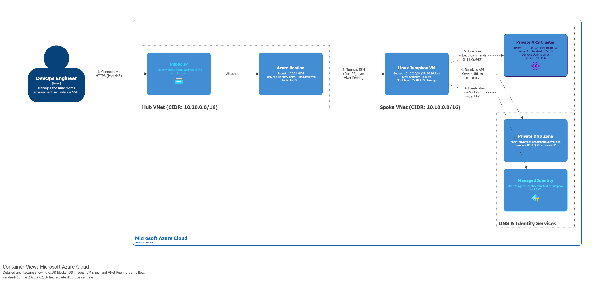

readme_content = """# Enterprise-Grade Private AKS in a Hub & Spoke Topology

This repository contains a production-ready Terraform deployment for a highly secure, fully private Azure Kubernetes Service (AKS) cluster. It implements a **Hub and Spoke** network architecture, ensuring that the Kubernetes API server and nodes are completely isolated from the public internet.

## 🏗️ Architecture Overview

To meet enterprise security standards, this architecture eliminates all public endpoints for the Kubernetes cluster and management VMs. 

- **Hub Virtual Network (`10.20.0.0/16`):** Contains the **Azure Bastion** host and a single Public IP. This acts as the only entry point into the secure environment.
- **Spoke Virtual Network (`10.10.0.0/16`):** Contains the **Private AKS Cluster** and a **Linux Jumpbox VM**.
- **VNet Peering:** Securely bridges the Hub and Spoke networks.
- **Private DNS Zone:** Automatically resolves the AKS API Server's internal IP address, allowing secure TLS communication via `kubectl`.
- **Identity & Access:** The Jumpbox uses an **Azure Managed Identity** (User-Assigned) for passwordless authentication to Azure resources, and access to the Jumpbox itself is secured via **SSH Keys** through Bastion.

## 📋 Prerequisites

Before you begin, ensure you have the following installed on your local machine (WSL/Linux recommended):
- [Terraform](https://developer.hashicorp.com/terraform/downloads) (>= 1.3.0)
- [Azure CLI](https://docs.microsoft.com/en-us/cli/azure/install-azure-cli)
- An active Azure Subscription (*This lab is optimized to run within the 6-vCPU limit of an **Azure for Students** subscription*).

## 🚀 Deployment Instructions

### 1. Authenticate with Azure
Log in to your Azure account using the Azure CLI:
### 2. Generate an SSH Key
ssh-keygen -t rsa -b 4096
### 3. Initialize and Deploy ... 
terraform init + plan + apply

### Option 1: Native SSH via Azure CLI (Recommended for Developers)
You can tunnel your local SSH connection directly through Bastion without opening the Azure Portal.

Install the required Azure CLI extensions:

```bash
az extension add --name bastion
az extension add --name ssh
```
Get the Resource ID of your Jumpbox VM:
```bash
VM_ID=$(az vm show -g private-aks-using-bastion-moez -n vm-linux-jumpbox --query id -o tsv)
```
Connect securely:
```bash
az network bastion ssh \
  --name "bastion" \
  --resource-group "private-aks-using-bastion-moez" \
  --target-resource-id $VM_ID \
  --auth-type "ssh-key" \
  --username "azureuser" \
  --ssh-key "~/.ssh/id_rsa"
  ```

### Option 2: Azure Portal (Browser-based)
Navigate to the Azure Portal.

Go to Virtual Machines -> vm-linux-jumpbox.

Click Connect -> Bastion.

Select SSH Private Key from Local File, upload your id_rsa file, and click Connect.

### Authenticating inside the Jumpbox

Once connected to the Jumpbox terminal, run the following commands to authenticate and verify cluster access:
```bash
# Log into Azure using the VM's Managed Identity (Passwordless!)
az login --identity

# Fetch the kubeconfig for the private cluster
az aks get-credentials -g private-aks-using-bastion-moez -n aks-cluster

# Verify connection to the API server
kubectl get nodes
```

### 🧹 Clean Up
```bash 
terraform destroy
```

### 📂 Repository Structure
- providers.tf: Terraform and Azure provider version constraints.

- variables.tf: Configurable variables (region, naming prefix, node counts).

- vnet.tf: Network topology (Hub & Spoke VNets, Subnets, and VNet Peering).

- aks.tf: Private AKS cluster definition and network profile (Cilium).

- bastion.tf: Azure Bastion host and Public IP setup in the Hub.

- vm-linux-jumpbox.tf: Ubuntu VM configuration, SSH key injection, and custom data scripts.

- identity-vm.tf: User-Assigned Managed Identity and Role Assignments.

- install-tools.sh: Bootstrapping script that installs Azure CLI and kubectl on the Jumpbox.

- output.tf: Useful output variables (Resource Group name, VM ID).


